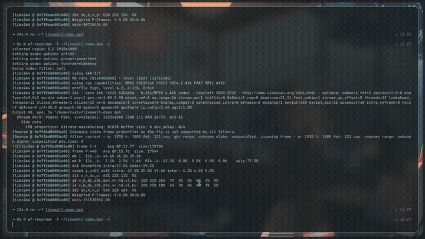

# LiveWall




A wallpaper *library manager* for Hyprland and Windows, with the actual
rendering done by a pluggable backend — [caelestia-aw](https://github.com/AdiAmbassador/caelestia-aw)
by default on Linux, [mpvpaper](https://github.com/GhostNaN/mpvpaper) if
you're not running [Caelestia](https://github.com/caelestia-dots/caelestia),
or a native mpv-based backend on Windows (see [Windows](#windows) below).

caelestia-aw already renders animated (mp4/webm/mkv/gif) and static wallpapers
natively inside the Caelestia shell — its own picker, thumbnailing, Material
You theming, battery/fullscreen pausing, and hardware decoding. LiveWall
doesn't duplicate any of that. It adds the things neither backend has a
concept of: **tags, favorites, search, duplicate detection, a proper library
browser, and scheduled random rotation** — then applies wallpapers through
whichever backend `config.json`'s `backend` field points to (`caelestia-aw`,
`mpvpaper`, or `windows-mpv`; see [Backends](#backends) below).

On Linux this is a terminal app; on Windows it's a native desktop GUI (no
terminal involved at all) that covers everything the Linux CLI does — see
[Windows](#windows).

## Requirements

**Linux:**
- Arch Linux, Hyprland, Wayland
- A wallpaper backend: [caelestia-aw](https://github.com/AdiAmbassador/caelestia-aw)
  installed and patched in (default), or [mpvpaper](https://github.com/GhostNaN/mpvpaper)
- `ffmpeg` / `ffprobe` (thumbnailing and metadata probing)
- `mpv` (optional, only for the standalone "preview in a window" feature)
- `zenity` (optional, only for the GUI's native "Add File" dialog)
- Python 3.12+, [`uv`](https://docs.astral.sh/uv/)

**Windows:**
- Windows 10 or 11
- Nothing else — the packaged `.exe` bundles everything it needs (including
  `mpv.exe`), no Python/uv install required

## Install

### Linux

```bash
git clone <this repo> ~/Projects/livewall
cd ~/Projects/livewall
uv tool install --editable .
```

This puts `livewall`, `livewall-gui`, and `livewall-picker` on your `PATH`
(via `~/.local/bin`). Being editable, pulling new commits takes effect
immediately — no reinstall needed.

Pull in whatever's already sitting in Caelestia's own wallpapers folder
(`~/Pictures/Wallpapers`, recursive) as a starting library:

```bash
livewall sync
```

### Windows

Download the latest `LiveWall-windows.zip` from
[Releases](../../releases), extract it anywhere, and run `LiveWall.exe`.
That's it — see [Windows](#windows) below for how it works.

## Usage

### CLI

```
livewall list [--query Q] [--tag t1,t2] [--type image|animated] [--favorites]
livewall add FILE [--tags t1,t2] [--name NAME]
livewall import FOLDER [--no-recursive] [--tags t1,t2]
livewall sync                        # import everything under caelestia-aw's wallpapers dir
livewall remove NAME
livewall rename OLD NEW
livewall favorite NAME [--unset]
livewall tag NAME "tag1, tag2"
livewall info NAME                   # resolution, duration, size, aspect ratio, ...
livewall apply NAME [--no-smart]     # --no-smart skips Material You recolouring (caelestia-aw only)
livewall random [--tag t] [--favorites] [--no-smart]
livewall status                      # what the current backend has applied
livewall preview NAME                # opens in a plain mpv window, not the desktop
livewall refresh-thumbs              # regenerate caelestia-aw's own video thumbnail cache (caelestia-aw only)
livewall restart-shell               # restart the Caelestia shell (caelestia-aw only, see "Known caelestia-aw issues")
livewall doctor                      # health-check the active backend, timers, keybind, desktop entry, library
livewall picker                      # the quick picker (see below)
livewall gui                         # the full library browser (see below)
livewall install hyprland            # add the Super+Shift+B picker keybind (opt-in, confirms first)
livewall install systemd --interval 15m|30m|1h   # scheduled random rotation (opt-in, confirms first)
livewall uninstall systemd           # stop and remove the random-rotation timer
livewall install sync-timer [--hours N]   # periodic 'livewall sync' (default 2h, opt-in, confirms first)
livewall uninstall sync-timer        # stop and remove the periodic sync timer
livewall install battery-saver [--low 15] [--high 25]   # opt-in, confirms first, see below
livewall uninstall battery-saver     # revert the battery saver (patch or timer, whichever backend)
livewall install boot-fix            # checks ~5s after login, restarts only if actually needed, see below
livewall uninstall boot-fix          # remove the boot-time check
livewall ensure-playing              # run that same check right now (what boot-fix calls)
livewall power-check                 # one battery-saver check-and-act cycle (what its timer calls, mpvpaper/capability-based backends only)
livewall install desktop-entry       # add LiveWall to your app launcher (opt-in, confirms first)
livewall uninstall desktop-entry     # remove it from the launcher
```

### GUI (`livewall gui`)

A Textual app: search/filter on the left, thumbnail + metadata detail pane on
the right, with quick-filter buttons for the preset categories (Cozy,
Synthwave, Anime, Space, Nature, Pixel Art, Cyberpunk — click to filter,
click again to clear; matches tags case-insensitively). The currently-applied
wallpaper is marked with `▶` in the list and in the detail pane. Keys: `/`
search, `a` apply, `f` favorite, `p` preview, `d` delete, `r` rename, `t` edit
tags, `i` import a folder, `o` add a single file via a native file-picker
dialog (`zenity`), `s` settings.

Run `livewall install desktop-entry` to make it launchable from your app
launcher (like Caelestia's own) instead of typing the command — it's a
`.desktop` entry whose `Exec=` opens it in a `foot` window, the standard
approach for terminal apps.

### Quick picker (`livewall picker`)

A rofi-style picker meant to run in a small floating terminal: type to
filter by name/tag, arrow keys to move, Enter applies instantly and closes,
Esc cancels. This is the one piece of UI caelestia-aw's own launcher doesn't
have — its picker can't filter by tag or favorite.

After `livewall install hyprland`, `Super+Shift+B` opens it in a centered
floating `foot` window.

## Windows

Windows users get a plain desktop app — no terminal, no commands to type.
Everything below is written for someone testing it for the first time.

⚠️ **This is a brand-new, unsigned app that has not yet been run on a real
Windows machine.** Two things follow from that, and neither means something
is broken:

1. **Windows will probably show a blue "Windows protected your PC" warning**
   the first time you run it (this is called SmartScreen, and it shows up
   for any new app that isn't from a large, well-known publisher yet — it's
   not a sign of a virus). See step 4 below for how to get past it.
2. **Your antivirus might flag or quarantine the file.** This is a known,
   common false positive for apps built with the tool LiveWall uses to
   package itself (PyInstaller) — plenty of legitimate small apps trigger
   it. If it happens, please note exactly what your antivirus said (name of
   the detection, e.g. "Trojan:Win32/Wacatac") when you report back — that's
   useful information even though it's very likely a false positive.

### How to install and run it

1. Go to the [Releases page](../../releases) and download the newest
   `LiveWall-windows.zip`.
2. Right-click the downloaded zip → **Extract All...** → choose a folder
   (your Desktop is fine) → **Extract**.
3. Open the folder that was just created and double-click **`LiveWall.exe`**.
4. If you see the blue "Windows protected your PC" screen: click
   **More info**, then click the **Run anyway** button that appears. (If you
   don't see this screen at all, that's fine too — just continue.)
5. LiveWall's window should open, showing your wallpaper library (empty on
   first run — see below).

### What to try

- **Add a wallpaper**: use the toolbar's "Import Folder" or "Add File"
  button to point LiveWall at a folder of images/videos, or a single file.
  A still image (`.jpg`/`.png`) is the simplest first test; a video
  (`.mp4`/`.webm`/`.mkv`/`.gif`) tests the more complex animated-wallpaper
  path.
- **Apply it**: select a wallpaper in the list and click "Apply" — it should
  become your actual Windows desktop background.
- **Quick picker**: in Settings, turn on "Run LiveWall in the system tray at
  login," then press **Win+Shift+B** anywhere — a small search-and-apply
  popup should appear (Enter applies, Esc cancels).
- **Settings**: open it via the gear icon or the tray icon's menu, and try
  toggling the automation options (random rotation, battery saver, restore
  wallpaper at login).

### If something goes wrong

Please [open an issue](../../issues) with: what you were doing, what you
expected vs. what happened, a screenshot if it's visual, and your Windows
version (Settings → System → About). The parts most likely to need a fix on
first real-world use are: **animated wallpapers not appearing** (or
appearing as a separate window instead of the desktop background), **the
Win+Shift+B hotkey not responding**, and **the scheduled automation
(rotation/battery saver/restore-at-login) not firing** — but please report
anything that seems off, however small.

### How it works (for reference, not required reading for testing)

It covers everything the Linux CLI does: browse/search/tag/favorite the
library, apply wallpapers, a settings screen, and toggles for the automation
Linux installs via `livewall install ...` (random rotation, restore-on-login,
battery-saver), backed by Windows Task Scheduler instead of systemd.

- **Animated wallpapers** render through a bundled `mpv.exe`, positioned
  behind your desktop icons using the same technique tools like Wallpaper
  Engine and Lively Wallpaper use (an unofficial but well-established
  Windows trick — see `backends/windows_mpv.py` for the details). Static
  images use the plain Windows wallpaper API.
- **Quick picker** (Win+Shift+B): unlike Linux, where Hyprland itself owns
  that keybind permanently, Windows only delivers it while LiveWall is
  running — so the app needs to run in the system tray in the background
  for the hotkey to always work.
- **Settings** (gear icon / tray menu → Open LiveWall → Settings) covers the
  same fields as the Linux GUI, plus a Windows-only "Startup" section for
  the tray/hotkey autostart and restore-on-login toggles.

### Settings

`livewall gui` → `s`. Besides the wallpaper backend itself, LiveWall only
controls what it adds on top of it: scheduled random interval,
favorites-only/tag-filtered random, and a Material-You-recolour opt-out
(caelestia-aw only). Rendering, HW decode, and pause-on-battery/fullscreen
under caelestia-aw are Caelestia's own settings — see its Nexus settings app.

Switching "Wallpaper backend" here takes effect immediately (no restart) —
apply a wallpaper afterward to see it render through the new backend. Some
CLI commands are backend-specific and will say so if you run them under the
wrong one: `restart-shell`/`refresh-thumbs`/`install boot-fix` all require
`caelestia-aw`. `install battery-saver` works under either backend, just
through a different mechanism for each — see [Battery saver](#battery-saver).

Changing "Random interval" here actually installs/removes the
`livewall-random.timer` systemd unit to match (same as
`livewall install/uninstall systemd`), not just a config value — so don't
hand-edit `random_interval` in `config.json`, it won't touch the timer.

## Architecture

No giant single file — each module owns one concern:

| Module | Responsibility |
|---|---|
| `config.py` | XDG paths, `Config` dataclass (load/save JSON) |
| `utils.py` | logging setup, hashing, formatting, format detection |
| `database.py` | `Wallpaper` dataclass + JSON-backed CRUD store |
| `thumbnail.py` | ffprobe metadata, ffmpeg thumbnail generation/caching |
| `library.py` | add/remove/rename/import/search/tag/favorite/dedupe, on top of `database.py` + `thumbnail.py` |
| `backends/` | `WallpaperBackend` interface + `CaelestiaAwBackend`/`MpvpaperBackend`/`WindowsMpvBackend` — LiveWall never renders anything itself, everything routes through whichever backend `config.json` selects |
| `preview.py` | plain `mpv` window preview — unrelated to whichever backend is active |
| `hypr.py` | opt-in Hyprland keybind/window-rule installer, with backups (Linux) |
| `desktop.py` | opt-in `.desktop` entry + icon so `livewall gui` shows up in your app launcher (Linux) |
| `doctor.py` | `livewall doctor` health checks across all of the above |
| `systemd.py` | opt-in systemd `--user` units: random rotation, periodic sync, boot-time pause-bug fix, battery-saver timer (Linux) |
| `battery.py` | opt-in `WallpaperPauser.qml` patch for battery-percentage pause, caelestia-aw only (see below) |
| `power_saver.py` | backend-agnostic battery-percentage pause/resume, for any backend with `supports_pause`/`supports_resume` (mpvpaper, windows-mpv) — see below |
| `cli.py` | argparse entry point (`livewall ...`) |
| `gui.py` | Textual library browser (Linux) |
| `picker.py` | Textual quick picker (Linux) |
| `windows/` | Task Scheduler / Start Menu / global-hotkey / battery-reading equivalents of `systemd.py`/`hypr.py`/`desktop.py`/`power_saver.py`'s battery read, for Windows |
| `gui_qt/` | the Windows-native GUI (PySide6) — library browser, settings, quick picker, tray+hotkey |

## Data locations

**Linux:**

- `~/.config/livewall/config.json` — settings
- `~/.local/share/livewall/library.json` — wallpaper metadata (tags, favorites, hashes)
- `~/.cache/livewall/thumbnails/` — LiveWall's own thumbnail cache (independent of caelestia-aw's own `~/.cache/caelestia/videothumbs/`)

**Windows:**

- `%APPDATA%\LiveWall\config.json` — settings
- `%APPDATA%\LiveWall\library.json` — wallpaper metadata (tags, favorites, hashes)
- `%LOCALAPPDATA%\LiveWall\cache\thumbnails\` — thumbnail cache

LiveWall never moves or copies your wallpaper files — the library just
stores paths into wherever they already live (by default,
`~/Pictures/Wallpapers` on Linux, your Pictures folder on Windows).

## Backends

LiveWall never renders a wallpaper itself — it applies through whichever
`WallpaperBackend` `config.json`'s `backend` field names (`livewall gui` → `s`
→ "Wallpaper backend", or hand-edit the field — any unrecognized value fails
with a clear error rather than silently falling back to another backend).

- **`caelestia-aw`** (default) — everything described in this README:
  Material You theming, thumbnail cache, restore-on-login, the pause-state
  workarounds below. Requires the caelestia-aw patch.
- **`mpvpaper`** — a plain, dotfiles-independent fallback for anyone not
  running Caelestia. No theming, no thumbnail cache, no restart/boot-fix
  concept (those CLI commands will refuse with a clear message under this
  backend). LiveWall tracks the spawned `mpvpaper` process itself so
  switching wallpapers never leaves an orphaned renderer behind, and talks
  to the underlying `mpv` process over its JSON IPC socket
  (`--input-ipc-server`, set automatically) for real pause/resume —
  `install battery-saver` works under this backend too, via
  `power_saver.py`'s systemd timer instead of a QML patch.
- **`windows-mpv`** (Windows only, selected automatically) — static images
  go through the plain Windows wallpaper API
  (`SystemParametersInfoW`/`SPI_SETDESKWALLPAPER`); animated wallpapers
  render through a bundled `mpv.exe` positioned behind the desktop icons
  (the same WorkerW technique Wallpaper Engine/Lively Wallpaper use — see
  [Windows](#windows)). Like `mpvpaper`, no theming, no thumbnail cache, and
  no restart/boot-fix concept — but `supports_pause`/`supports_resume` are
  both true, so battery saver works here too, driven by
  `power_saver.py` + Windows Task Scheduler instead of a systemd timer.

Adding a third backend (swww, hyprpaper, swaybg, ...) means writing one
`WallpaperBackend` implementation in `backends/` — no changes anywhere else.

## Battery saver

`livewall install battery-saver [--low 15] [--high 25]` works under either
backend, but through a genuinely different mechanism — pick the section
below for whichever `config.json`'s `backend` is currently set to.

### Under `mpvpaper`

mpv doesn't know or care about system battery state, so there's no internal
hook to extend the way caelestia-aw has one (below). Instead, `install
battery-saver` installs a systemd `--user` timer
(`livewall-power-saver.timer`, every 20s) that runs `livewall power-check`
— a single hysteresis check-and-act cycle in `power_saver.py`: reads the
first battery under `/sys/class/power_supply/*/capacity` (skips cleanly, no
error, on a desktop with no battery), and calls the backend's real
`pause()`/`resume()` (mpv's `set_property pause`, over the same IPC socket
`set_wallpaper()` already opens) when the configured thresholds are
crossed. Hysteresis state persists in `~/.cache/livewall/
power_saver_state.json` between timer runs, since each firing is a fresh
process. `livewall doctor` reports this as "Battery saver timer"; `livewall
uninstall battery-saver` stops and removes it.

This mechanism isn't hardcoded to mpvpaper — it drives any backend through
`WallpaperBackend.pause()`/`resume()`, gated on the `supports_pause`/
`supports_resume` capability flags, so a future backend gets battery-saving
for free just by implementing those two methods honestly.

### Under `caelestia-aw`

caelestia-aw's own `WallpaperPauser` only knows "on AC or not" — no
percentage threshold — and exposes no pause/resume IPC for wallpapers at all
(`caelestia shell -s` shows `target wallpaper` has only `list/set/get`). A
static-frame swap was tried first and abandoned: static images are broken on
some caelestia-aw installs (confirmed by applying caelestia-aw's own bundled
default wallpaper and getting the same result), independent of anything
LiveWall generates — not something fixable from here.

So `livewall install battery-saver` instead makes a small, targeted patch to
caelestia-aw's own `WallpaperPauser.qml`: it adds a battery-**percentage**
check (`UPower.displayDevice.percentage`) with its own hysteresis (default
15% low / 25% high) alongside the existing AC-based rule, and reacts to
`percentageChanged` immediately — no polling. When it fires, it calls
caelestia-aw's real internal `pause()`/`resume()`, which freezes and resumes
the actual current video frame in place, exactly like its existing
pause-behind-windows feature already does, just driven by percentage instead
of AC status.

This is the one part of LiveWall that edits a caelestia-aw file instead of
just calling its CLI. On Arch/AUR installs `WallpaperPauser.qml` is normally
owned by your own user (not root), so no `sudo` is needed — but a
`caelestia-shell` package update will overwrite it, so re-run `livewall
install battery-saver` after that happens. A backup is made automatically
(`WallpaperPauser.qml.livewall.bak`) and `livewall uninstall battery-saver`
restores it.

## Known caelestia-aw issues LiveWall works around

- **Wallpapers frozen on their first frame.** caelestia-aw's `WallpaperPauser`
  (its pause-on-battery / pause-behind-windows feature) occasionally fails to
  initialize its settings backend on shell startup (`Failed to initialize
  QSettings instance` in `caelestia shell -l`), silently pinning
  "pause behind windows" to on regardless of what you've set in Nexus
  settings — which freezes all video wallpapers. Run `livewall restart-shell`
  to force a clean re-init; `livewall gui`/`livewall picker` will still
  *apply* correctly even while this is happening, they just won't visibly
  animate until the shell is restarted. This can happen on the shell's very
  *first* launch too (i.e. right after login/boot, since `caelestia shell -d`
  runs via Hyprland's own startup hook) — `livewall install boot-fix` installs
  a systemd `--user` service that runs `livewall ensure-playing` ~5s after
  every login. That command samples decode CPU on the current video briefly
  and only restarts the shell if it's genuinely not decoding — most boots
  never hit the bug, so this skips the (slow) restart entirely instead of
  paying its cost unconditionally on every login.
- **`.gif` files never animate**, independent of the above — caelestia-aw
  only plays real video containers (`.mp4`/`.webm`/`.mkv`) via QtMultimedia;
  `.gif` always renders as a static first frame (both its Python CLI's
  `is_video()` and QML's `Wallpapers.isVideo()` exclude it). If your library
  has both formats of the same wallpaper, `livewall random` and the picker
  both prefer the non-`.gif` copy automatically for this reason.
